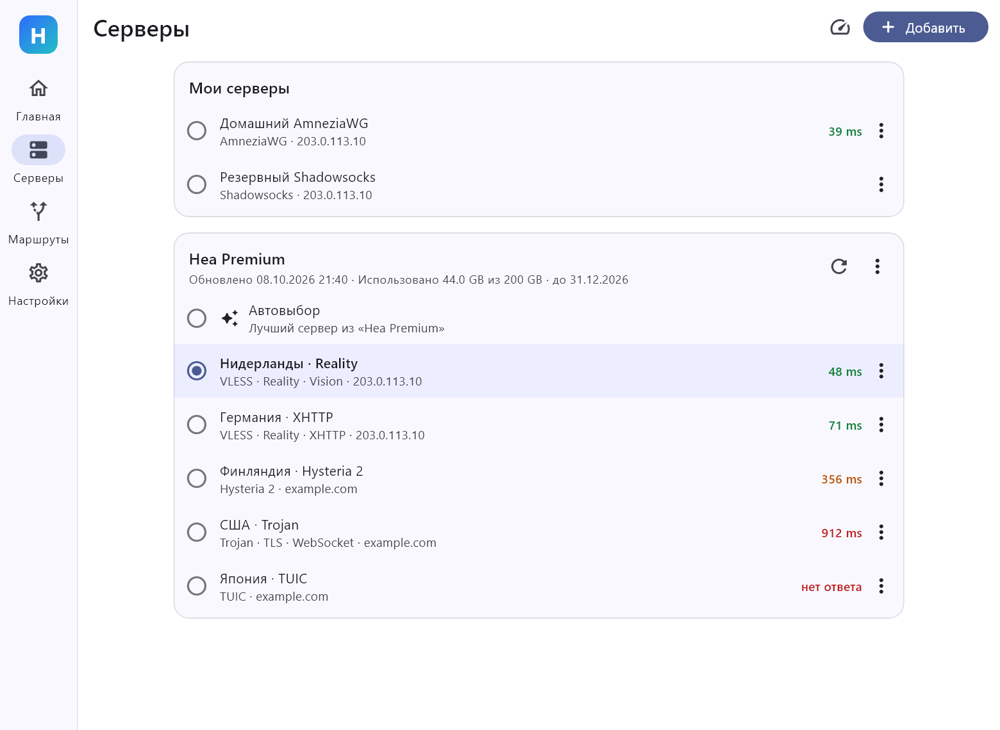
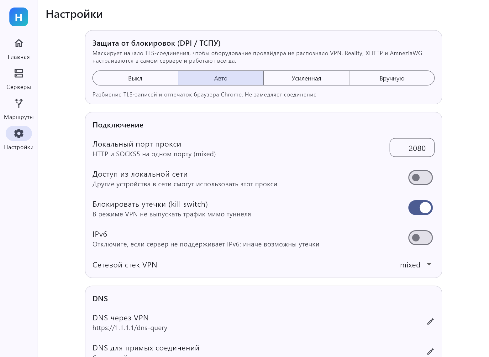

# HeaNetwork

VPN-клиент для **Windows** и **Android** с понятным интерфейсом, маршрутизацией
по приложениям и защитой от блокировок. Работает со всеми подключениями панели
**3x-ui** и не только.

[English summary](#english) · [Скачать](https://github.com/zarkon4631/HeaNetwork/releases/latest)

| | |
|---|---|
|  |  |
|  |  |

## Возможности

- **Протоколы**: VLESS, VMess, Trojan, Shadowsocks (включая 2022), WireGuard,
  AmneziaWG (1.x–2.0), Hysteria, Hysteria 2, TUIC, SOCKS, HTTP.
- **Транспорты и маскировка**: Reality, XHTTP, WebSocket, gRPC, HTTPUpgrade,
  mKCP, VLESS encryption, XTLS Vision, obfs у Hysteria 2.
- **Режимы**: системный прокси (без прав администратора) и VPN/TUN (весь трафик).
  Локальный порт `mixed` (HTTP + SOCKS5) доступен всегда.
- **Маршрутизация по приложениям**: для каждой программы один переключатель —
  *Напрямую*, *Через VPN* или *Блок*. На Windows программа выбирается из списка
  запущенных с иконками, на Android — из установленных приложений. Приложение,
  отправленное «напрямую» на Android, вообще не видит VPN, поэтому банковские
  приложения работают как обычно.
- **Маршрутизация по сайтам**: готовый переключатель «Российские сайты напрямую»,
  блокировка рекламы, свои правила по домену, слову или IP-диапазону.
- **Защита от блокировок (DPI / ТСПУ)** одним переключателем: *Выкл / Авто /
  Усиленная / Вручную*. Подробнее — [ниже](#защита-от-блокировок).
- **Импорт**: ссылка из буфера обмена, QR-код, файл `.conf` / `.json`, подписка
  с автоопределением формата, ключ AmneziaVPN (`vpn://`).
- **Подписки**: остаток трафика и срок действия, автовыбор самого быстрого сервера.
- **Проверка задержки** настоящим запросом через сервер, а не пингом.
- **Проброс портов**: локальный порт → адрес за VPN (клиентская часть `tunnel`).
- **Обновления** из GitHub Releases с проверкой SHA-256 перед установкой.
- Kill switch, защита от утечек DNS и IPv6, FakeIP, трей и автозапуск на Windows,
  русский и английский языки, светлая и тёмная темы.

## Установка

Скачайте файл со [страницы релизов](https://github.com/zarkon4631/HeaNetwork/releases/latest):

| Платформа | Файл |
|---|---|
| Windows 10/11 x64 | `HeaNetwork-…-windows-x64-setup.exe` — установщик без прав администратора |
| Windows, без установки | `HeaNetwork-…-windows-x64-portable.zip` |
| Android 7.0+ | `HeaNetwork-…-android-arm64-v8a.apk` (почти все телефоны) или `…-universal.apk` |

Установщик Windows не подписан сертификатом, поэтому SmartScreen покажет
предупреждение: «Подробнее» → «Выполнить в любом случае». Контрольные суммы
всех файлов лежат в `SHA256SUMS.txt` рядом с релизом.

## Быстрый старт

1. В панели 3x-ui скопируйте ссылку подключения (или ссылку подписки).
2. В HeaNetwork откройте **Серверы → Добавить → Вставить из буфера**.
3. Нажмите большую кнопку на главном экране.

На Windows по умолчанию включён режим «Системный прокси». Чтобы через VPN шёл
трафик всех программ, включая игры, переключитесь на «VPN (весь трафик)» —
приложение предложит перезапуститься с правами администратора.

## Защита от блокировок

Эталонные клиенты ([Throne](https://github.com/throneproj/Throne),
[NekoBox](https://github.com/qr243vbi/nekobox)) защищаются от анализа трафика
не отдельным «шифрованием», а набором приёмов маскировки. HeaNetwork использует
те же приёмы и добавляет к ним понятные пресеты.

| Приём | Что делает | Где включается |
|---|---|---|
| Reality, XHTTP, VLESS encryption | Соединение неотличимо от обычного HTTPS | в профиле сервера |
| AmneziaWG | Мусорные пакеты и изменённые заголовки WireGuard | в профиле сервера |
| Obfs (salamander) у Hysteria 2 | Скрывает QUIC | в профиле сервера |
| Разбиение TLS-записей | Имя сервера не попадает в один пакет | пресет «Авто» |
| Отпечаток браузера (uTLS) | TLS выглядит как Chrome | пресет «Авто» |
| Дробление TCP-пакетов | Сильнее, но медленнее | пресет «Усиленная» |
| Обработка прямых соединений | Помогает с замедляемыми сайтами без VPN | пресет «Усиленная» |
| Подмена SNI | Ложное приветствие с разрешённым доменом | «Вручную», режим администратора |

## Как это устроено

- Интерфейс и логика — **Flutter** (один код для Windows и Android).
- Ядро — [sing-box-extended](https://github.com/shtorm-7/sing-box-extended)
  (форк [sing-box](https://github.com/SagerNet/sing-box) с XHTTP, AmneziaWG и
  VLESS encryption), версия зафиксирована в [`tool/core.json`](tool/core.json).
  На Windows это отдельный процесс, на Android — библиотека внутри `VpnService`.
- Ссылки и конфигурации разбирает само приложение
  ([`lib/core/parsers`](lib/core/parsers)), оно же строит конфигурацию ядра
  ([`lib/core/config`](lib/core/config)).

## Сборка из исходников

Нужен [Flutter](https://docs.flutter.dev/get-started/install) 3.47+.

```powershell
# ядро для Windows и списки маршрутизации (проверяются по SHA-256)
powershell -ExecutionPolicy Bypass -File tool\fetch_assets.ps1

flutter pub get
flutter test          # включая сквозные тесты через настоящее ядро
flutter build windows # нужен Visual Studio с «Разработкой классических приложений на C++»
```

Для Android дополнительно нужны Go, JDK 17 и Android NDK:

```bash
bash tool/build_libbox.sh   # собирает ядро в android/app/libs/libbox.aar
flutter build apk --split-per-abi
```

Каждый коммит собирается в GitHub Actions
([`.github/workflows/build.yml`](.github/workflows/build.yml)); тег вида
`v1.2.3` публикует релиз, который и находит встроенное обновление.

### Тесты

- `test/parsers_test.dart` — разбор ссылок всех протоколов и форматов.
- `test/core_check_test.dart` — каждая сгенерированная конфигурация проверяется
  настоящим ядром (`sing-box check`).
- `test/e2e_test.dart` — локальный сервер на том же ядре, через каждый протокол
  реально передаётся трафик.
- `test/screens_test.dart` — все экраны на размерах компьютера и телефона;
  с `HEA_SCREENSHOTS=1` сохраняет скриншоты в `docs/screenshots`.

## Лицензия

[GPL-3.0](LICENSE). Ядро sing-box и его форк распространяются под GPL-3.0.
Реализация VPN-сервиса Android следует устройству
[sing-box-for-android](https://github.com/SagerNet/sing-box-for-android).

---

## English

HeaNetwork is a VPN client for **Windows** and **Android** built around three
ideas: an interface a non-expert can use, per-application routing, and
censorship resistance that is one switch instead of a page of options.

- **Protocols**: VLESS, VMess, Trojan, Shadowsocks (incl. 2022), WireGuard,
  AmneziaWG, Hysteria, Hysteria 2, TUIC, SOCKS, HTTP — every connection type a
  3x-ui panel offers, with Reality, XHTTP, WebSocket, gRPC, HTTPUpgrade and mKCP.
- **Per-app routing**: pick an app and choose *Direct*, *Via VPN* or *Block*.
- **Anti-DPI presets**: TLS record/segment fragmentation, uTLS fingerprints,
  optional SNI spoofing.
- **Import** from clipboard, QR code, file or subscription URL.
- **Self-update** from GitHub Releases, verified against SHA-256.

It is a Flutter app driving the
[sing-box-extended](https://github.com/shtorm-7/sing-box-extended) core.
Download builds from the
[releases page](https://github.com/zarkon4631/HeaNetwork/releases/latest).
Licensed under GPL-3.0.
