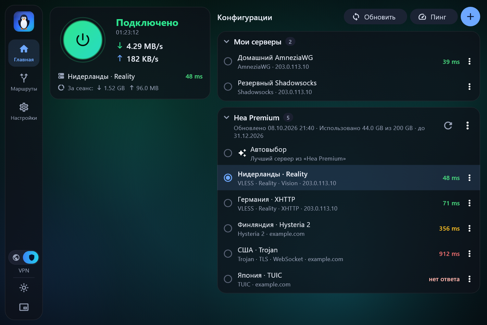
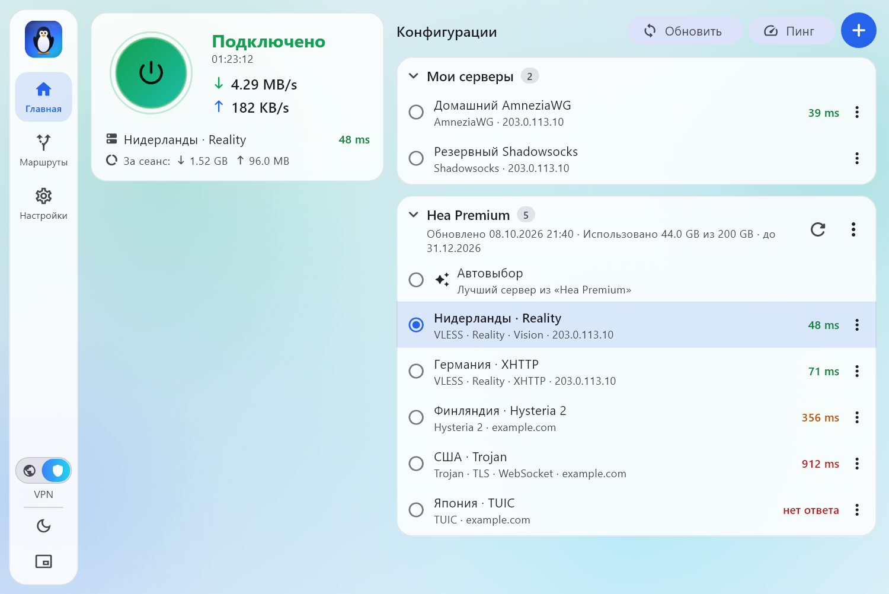
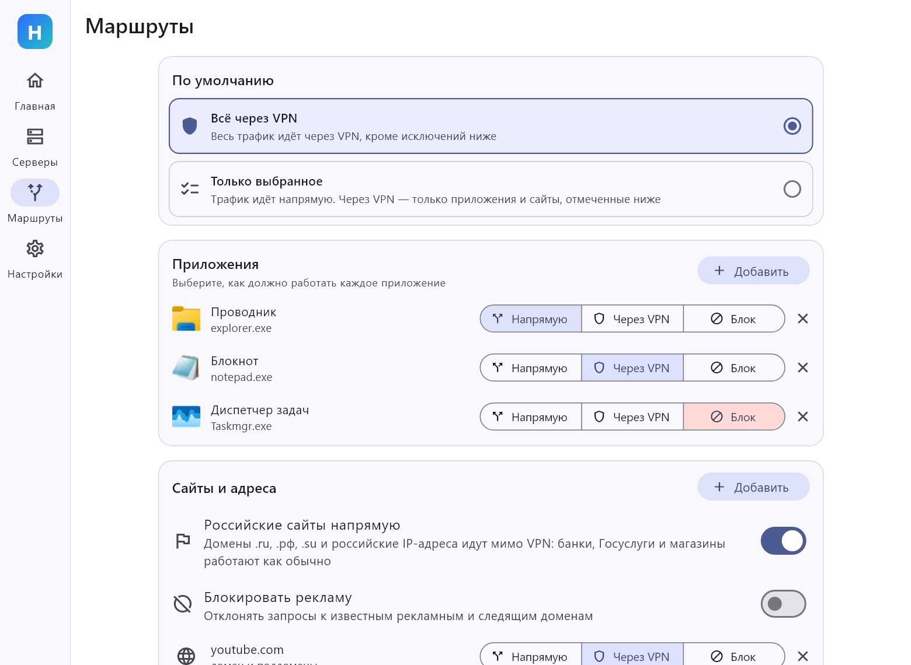
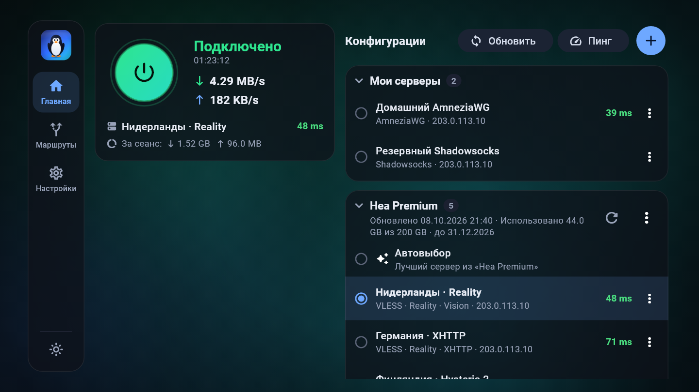
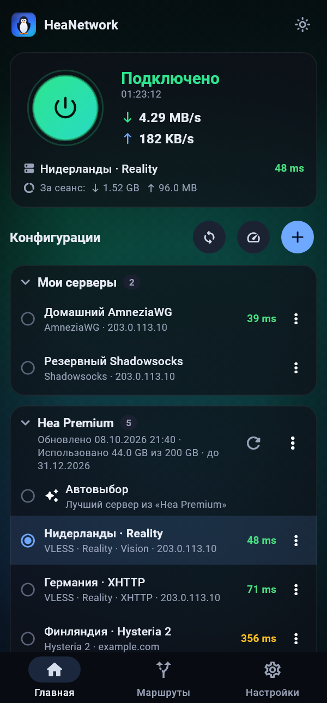
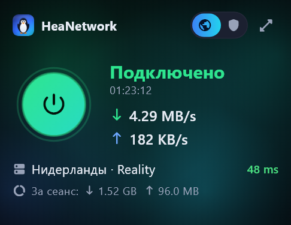

<p align="center"></p>

# HeaNetwork

VPN-клиент для **Windows**, **Android** и **Android TV** с понятным интерфейсом,
маршрутизацией по приложениям и защитой от блокировок. Работает со всеми
подключениями панели **3x-ui** и не только.

[English summary](#english) · [Скачать](https://github.com/zarkon4631/HeaNetwork/releases/latest)

| | |
|---|---|
|  |  |
|  |  |

<p align="center">
  
  &nbsp;&nbsp;
  
</p>

## Возможности

- **Протоколы**: VLESS, VMess, Trojan, Shadowsocks (включая 2022), WireGuard,
  AmneziaWG (1.x–3.x), Hysteria, Hysteria 2, TUIC, SOCKS, HTTP.
- **Транспорты и маскировка**: Reality, XHTTP, WebSocket, gRPC, HTTPUpgrade,
  mKCP, VLESS encryption, XTLS Vision, obfs у Hysteria 2.
- **Режимы**: системный прокси (без прав администратора) и VPN/TUN (весь трафик),
  переключаются слайдером слева снизу. Локальный порт `mixed` доступен всегда.
- **Главный экран**: кнопка подключения со скоростью рядом, трафик за сеанс,
  обновление подписок, пинг всех серверов одной кнопкой и сам список конфигураций.
  Подписки и «Мои серверы» сворачиваются нажатием на заголовок; свёрнутая группа
  продолжает показывать выбранный в ней сервер.
- **Пинг по TCP**: время соединения с самим сервером, замер идёт мимо VPN-туннеля,
  даже если тот включён. В настройках можно выбрать замер «через сервер» —
  задержку настоящего запроса; для WireGuard, Hysteria и TUIC он используется
  всегда, потому что TCP они не принимают.
- **Маршрутизация по приложениям**: для каждой программы один переключатель —
  *Напрямую*, *Через VPN* или *Блок*. На Windows программа выбирается из списка
  запущенных с иконками, на Android — из установленных приложений. Приложение,
  отправленное «напрямую» на Android, вообще не видит VPN, поэтому банковские
  приложения работают как обычно.
- **Маршрутизация по сайтам**: «Российские сайты напрямую», блокировка рекламы,
  свои правила по домену, слову или IP-диапазону.
- **Защита от блокировок (DPI / ТСПУ)** одним переключателем: *Выкл / Авто /
  Усиленная / Вручную*. Подробнее — [ниже](#защита-от-блокировок).
- **Подписки 3x-ui**: обычные и JSON, остаток трафика и срок, объявления и ссылка
  поддержки из панели, автообновление с интервалом, который задаёт панель,
  автовыбор самого быстрого сервера. Подробнее — [ниже](#подписки-3x-ui-и-hwid).
- **HWID**: приложение сообщает панели идентификатор устройства, чтобы работал
  лимит устройств на подписку.
- **Android TV**: интерфейс под пульт и телевизионный экран; подписку удобно
  [прислать с телефона по QR-коду](#android-tv).
- **Виджет Android**: подключение и переключение серверов с главного экрана.
- **Компактный вид** (Windows): маленькое окно поверх остальных — только кнопка
  и скорость.
- **Импорт**: буфер обмена, QR-код, файл `.conf` / `.json`, подписка, ключ `vpn://`.
- **Обновления** из GitHub Releases с проверкой SHA-256 перед установкой.
- Тёмная и светлая темы с анимированным фоном, kill switch, защита от утечек
  DNS и IPv6, FakeIP, проброс портов, трей и автозапуск, русский и английский.

## Установка

Скачайте файл со [страницы релизов](https://github.com/zarkon4631/HeaNetwork/releases/latest):

| Платформа | Файл |
|---|---|
| Windows 10/11 x64 | `HeaNetwork-…-windows-x64-setup.exe` — установщик без прав администратора |
| Windows, без установки | `HeaNetwork-…-windows-x64-portable.zip` |
| Android 7.0+ и Android TV | `HeaNetwork-…-android-arm64-v8a.apk` (почти все устройства), `…-armeabi-v7a.apk` (старые ТВ-приставки) или `…-universal.apk` |

Установщик Windows не подписан сертификатом, поэтому SmartScreen покажет
предупреждение: «Подробнее» → «Выполнить в любом случае». Контрольные суммы
всех файлов лежат в `SHA256SUMS.txt` рядом с релизом.

## Быстрый старт

1. В панели 3x-ui скопируйте ссылку подключения (или ссылку подписки).
2. В HeaNetwork нажмите **+** → **Вставить из буфера**.
3. Нажмите кнопку подключения.

На Windows по умолчанию включён режим «Системный прокси». Чтобы через VPN шёл
трафик всех программ, включая игры, переведите слайдер слева снизу в положение
VPN — приложение предложит перезапуститься с правами администратора.

При закрытии окна приложение спрашивает: отменить, закрыть полностью или
свернуть в трей. Ответ можно запомнить и поменять потом в настройках.

### Программа не видит VPN или пишет об ошибке входа

В режиме «Системный прокси» через VPN идут только программы, которые сами
читают настройки прокси Windows: браузеры и большинство обычных приложений.
Игры и консольные программы — Claude Code, git, npm, pip — этих настроек не
читают и выходят в сеть напрямую. Сервис при этом видит ваш настоящий адрес и
может отказать: например, Claude отвечает «Authentication failed», хотя сайт
в браузере открывается.

Решение — режим **VPN** (слайдер слева снизу): в нём через туннель идёт трафик
всех программ. Если права администратора недоступны, программе можно указать
прокси вручную: `HTTPS_PROXY=http://127.0.0.1:2080` (порт — из настроек).

## Android TV

Интерфейс рассчитан на пульт: кнопка подключения сразу в фокусе, по списку
серверов и меню можно ходить стрелками.

Чтобы не набирать ссылку пультом:

1. На телевизоре: **+** → **Получить с телефона (QR)**.
2. Подключите телефон к той же сети Wi-Fi и отсканируйте код камерой.
3. На открывшейся странице вставьте ссылку подписки и нажмите «Отправить».

Если на телефоне тоже установлен HeaNetwork, можно отсканировать код его
сканером (**+** → **Сканировать QR-код**) — он предложит отправить на телевизор
все ваши подписки и серверы разом.

## Подписки 3x-ui и HWID

Приложение понимает то, что панель реально отдаёт (проверено по исходникам
3x-ui 3.9):

- ссылки всех протоколов, включая AmneziaWG в виде `vpn://…` и параметры
  `fm` (фрагментация), `x_padding_bytes`, `support-x25519mlkem768`, `mport`;
- JSON-подписку (массив конфигураций Xray);
- заголовки `Subscription-Userinfo`, `Profile-Title`, `Profile-Update-Interval`,
  `Announce`, `Support-Url`.

**Параметры из подписки всегда имеют приоритет.** Если сервер сам задаёт
отпечаток TLS или фрагментацию, приложение их не меняет ни при каком пресете —
оно только добавляет то, чего в конфигурации нет. Обычное обновление подписки
не сбрасывает выбранный сервер и не просит переподключиться, если сервер не
изменился.

**HWID.** При запросе подписки отправляются заголовки `X-HWID`, `X-Device-OS`,
`X-Ver-OS`, `X-Device-Model` — так панель считает устройства и применяет лимит.
Идентификатор — хэш от ID устройства, сам ID наружу не уходит; он показан в
настройках и отправляется только серверу подписки. Если лимит исчерпан,
приложение прямо об этом скажет. Отправку можно выключить в настройках.

## Защита от блокировок

Эталонные клиенты ([Throne](https://github.com/throneproj/Throne),
[NekoBox](https://github.com/qr243vbi/nekobox)) защищаются от анализа трафика
не отдельным «шифрованием», а набором приёмов маскировки. HeaNetwork использует
те же приёмы и добавляет к ним понятные пресеты.

| Приём | Что делает | Где включается |
|---|---|---|
| Reality, XHTTP, VLESS encryption | Соединение неотличимо от обычного HTTPS | в профиле сервера |
| AmneziaWG | Мусорные пакеты и изменённые заголовки WireGuard | в профиле сервера |
| Obfs (salamander) у Hysteria 2 | Скрывает QUIC | в профиле сервера |
| Фрагментация из панели (`fm`) | То, что настроил администратор сервера | в профиле сервера |
| Разбиение TLS-записей | Имя сервера не попадает в один пакет | пресет «Авто» |
| Отпечаток браузера (uTLS) | TLS выглядит как Chrome | пресет «Авто» |
| Дробление TCP-пакетов | Сильнее, но медленнее | пресет «Усиленная» |
| Обработка прямых соединений | Помогает с замедляемыми сайтами без VPN | пресет «Усиленная» |
| Подмена SNI | Ложное приветствие с разрешённым доменом | «Вручную», режим администратора |

## Как это устроено

- Интерфейс и логика — **Flutter** (один код для Windows, Android и Android TV).
- Ядро — [sing-box-extended](https://github.com/shtorm-7/sing-box-extended)
  (форк [sing-box](https://github.com/SagerNet/sing-box) с XHTTP, AmneziaWG и
  VLESS encryption), версия зафиксирована в [`tool/core.json`](tool/core.json).
  На Windows это отдельный процесс, на Android — библиотека внутри `VpnService`.
- Ссылки и конфигурации разбирает само приложение
  ([`lib/core/parsers`](lib/core/parsers)), оно же строит конфигурацию ядра
  ([`lib/core/config`](lib/core/config)).

## Сборка из исходников

Нужен [Flutter](https://docs.flutter.dev/get-started/install) 3.47+.

```powershell
# ядро для Windows и списки маршрутизации (проверяются по SHA-256)
powershell -ExecutionPolicy Bypass -File tool\fetch_assets.ps1

flutter pub get
flutter test          # включая сквозные тесты через настоящее ядро
flutter build windows # нужен Visual Studio с «Разработкой классических приложений на C++»
```

Для Android дополнительно нужны Go, JDK 17 и Android NDK:

```bash
bash tool/build_libbox.sh   # собирает ядро в android/app/libs/libbox.aar
flutter build apk --split-per-abi
```

Каждый коммит собирается в GitHub Actions
([`.github/workflows/build.yml`](.github/workflows/build.yml)); тег вида
`v1.2.3` публикует релиз, который и находит встроенное обновление.

### Тесты

- `test/parsers_test.dart`, `test/panel_formats_test.dart` — разбор ссылок,
  форматов 3x-ui и JSON-подписок.
- `test/core_check_test.dart` — каждая сгенерированная конфигурация проверяется
  настоящим ядром (`sing-box check`).
- `test/e2e_test.dart` — локальный сервер на том же ядре, через каждый протокол
  реально передаётся трафик.
- `test/core_process_test.dart` — запуск, остановка и сбои процесса ядра.
- `test/latency_test.dart` — пинг по TCP, обход туннеля, замер через сервер.
- `test/subscription_test.dart` — HWID, лимит устройств, обновление подписок,
  приём по QR.
- `test/screens_test.dart` — все экраны на размерах компьютера, телефона и
  телевизора; с `HEA_SCREENSHOTS=1` сохраняет скриншоты в `docs/screenshots`.

Значок рисуется скриптом [`tool/gen_icons.mjs`](tool/gen_icons.mjs).

## Лицензия

[GPL-3.0](LICENSE). Ядро sing-box и его форк распространяются под GPL-3.0.
Реализация VPN-сервиса Android следует устройству
[sing-box-for-android](https://github.com/SagerNet/sing-box-for-android).

---

## English

HeaNetwork is a VPN client for **Windows**, **Android** and **Android TV**
built around three ideas: an interface a non-expert can use, per-application
routing, and censorship resistance that is one switch instead of a page of
options.

- **Protocols**: VLESS, VMess, Trojan, Shadowsocks (incl. 2022), WireGuard,
  AmneziaWG, Hysteria, Hysteria 2, TUIC, SOCKS, HTTP — every connection type a
  3x-ui panel offers, with Reality, XHTTP, WebSocket, gRPC, HTTPUpgrade and mKCP.
- **Per-app routing**: pick an app and choose *Direct*, *Via VPN* or *Block*.
- **Anti-DPI presets**: TLS record/segment fragmentation, uTLS fingerprints,
  optional SNI spoofing. Settings carried by a server always win.
- **3x-ui subscriptions**: plain and JSON, usage and expiry, panel-defined
  refresh interval, and HWID headers for the panel's device limit.
- **Android TV** with remote-friendly navigation and a QR code to send a
  subscription from a phone; a home-screen **widget** on Android; a compact
  always-on-top window on Windows.
- **Self-update** from GitHub Releases, verified against SHA-256.

It is a Flutter app driving the
[sing-box-extended](https://github.com/shtorm-7/sing-box-extended) core.
Download builds from the
[releases page](https://github.com/zarkon4631/HeaNetwork/releases/latest).
Licensed under GPL-3.0.
